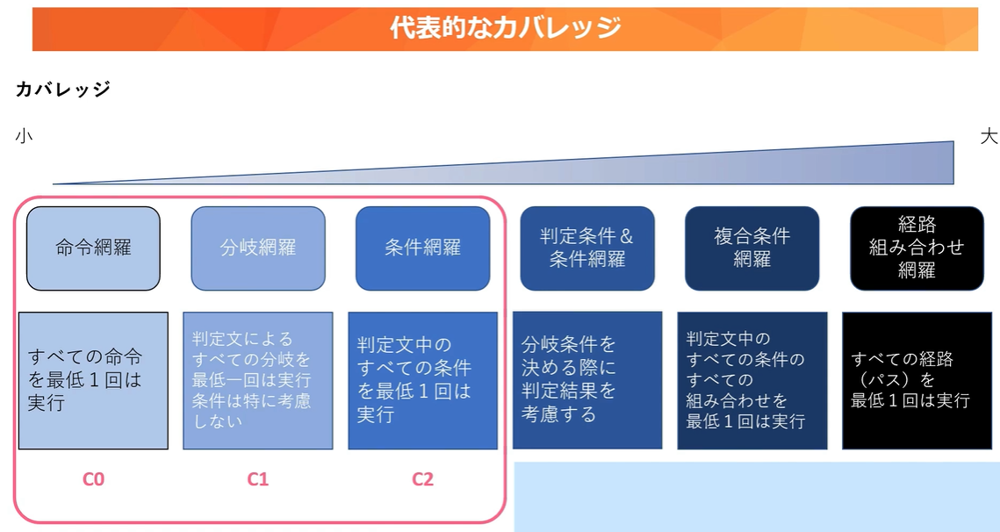

# JUnit まとめ

## 概要

- **JUnit**は、Java 専用のテスティングフレームワークです。
- アノテーションを使い、クラスの関数や例外処理が正しく行えるか簡単に評価できます。
- @Test アノテーションをつけ、戻り型は void

---

## カバレッジ（網羅率）について

- **命令網羅**

  - すべての処理（命令）を 1 回以上実行すること

- **分岐網羅**

  - すべての分岐（if や switch）について、真と偽の両方を試すこと
  - 例: `if(A||B)` なら、A||B が真になる場合と偽になる場合の両パターンをテスト

- **条件網羅**
  - 各条件の真偽を個別に試すこと
  - 例: `if(A||B)` なら、A の真・偽、B の真・偽をそれぞれテスト

<div align="center">
  
</div>

## テスト用フォルダの場所

<div align="center">
  
</div>

## テスト作成手順

1. **パッケージ・エクスプローラーで新規ソースフォルダ作成**

   - パッケージ・エクスプローラー上で右クリック
   - 「新規」→「ソースフォルダー」を選択
   - フォルダ名に `test` を入力して作成

2. **テストクラスの作成**

   - 作成した `test` フォルダを右クリック
   - 「新規」→「クラス」でテスト用クラスを作成

3. **テストメソッドのひな形をテンプレートで作成**

   - エディタ上で `Ctrl + 9` を押す
   - テストメソッドのひな形が自動で挿入される
   - 「スーパークラス」の入力欄は空白のままで OK

4. **テストコードを記述**

   - `@Test` アノテーションをつけてテストメソッドを作成
   - 例：

     ```java
     import org.junit.jupiter.api.Test;

     class SampleTest {
         @Test
         void testSample() {
             // テストコードを書く
         }
     }
     ```

5. **テストの実行**
   - パッケージ・エクスプローラーでテストクラスを右クリック
   - 「実行」→「JUnit テスト」を選択

---

## 有名なテスト用のアサーション

&emsp;JUnit には、テスト結果を判定するためのアサーションメソッドがいくつかあります。  
ここでは代表的なものをまとめます。

---

## assertEquals(期待値、実測値)

&emsp;期待値と実測値が等しいときにテスト成功

<div align="center">
  
</div>

---

## assertThrows(発生するであろう例外のクラス名、テスト対象の処理をラムダ式で書く)

&emsp;指定した例外が発生することを確認したい場合に使います

<div align="center">
  
</div>

---

## fail("失敗時のメッセージ"※任意)

&emsp;強制的に失敗させたいとき、例外が発生しているか確認する用途などで使います

<div align="center">
  
</div>

---

## ほかにも以下のようなアサーションメソッドあるよ

<div align="center">
  
</div>
